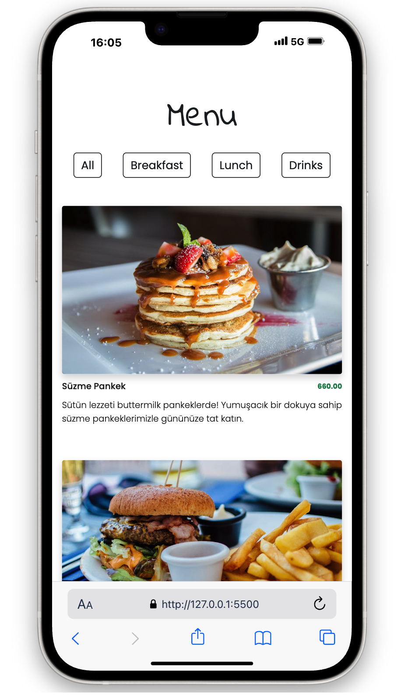

# Restaurant Menu

Bu proje, kullanıcıların yiyecek ve içecek menüsünü inceleyebileceği dinamik bir **Restaurant Menu** uygulamasıdır. **HTML**, **CSS**, **Bootstrap**, **JavaScript** ve **Google Fonts** kullanılarak geliştirilmiştir. Tasarım tamamen **responsive** olup, farklı cihazlara uyumludur.

## ✨ Özellikler

* **Responsive Tasarım**: Tüm ekran boyutlarında sorunsuz görüntüleme.
* **Dinamik Menü**: Menü öğeleri JavaScript ile dinamik olarak listelenmektedir.
* **Detay Sayfaları**: Her bir ürün için ayrı detay sayfası oluşturulmuştur.
* **Modern Fontlar**: Google Fonts üzerinden `Indie Flower` ve `Poppins` fontları kullanılmıştır.
* **Bootstrap Entegrasyonu**: Hızlı ve şık tasarım için Bootstrap bileşenleri kullanılmıştır.

## 📚 Kullanılan Teknolojiler

* **HTML5**
* **CSS3**
* **JavaScript**
* **Bootstrap**
* **Google Fonts**

## 🚀 Kurulum

Projeyi çalıştırmak için aşağıdaki adımları izleyin:

1. Bu repoyu klonlayın:

   ```bash
   git clone https://github.com/Bahadir34/restaurant-menu.git
   ```
2. Proje klasörüne gidin:

   ```bash
   cd restaurant-menu
   ```
3. `index.html` dosyasını tarayıcınızda açın.

## 🖼️ Ekran Görüntüleri




## 👤 Katkıda Bulunma

Projeye katkıda bulunmak isterseniz **pull request** açabilirsiniz.

## 🌐 Canlı Önizleme


---

_Bu proje eğitim amaçlı geliştirilmiştir ve ticari bir amacı bulunmamaktadır._
